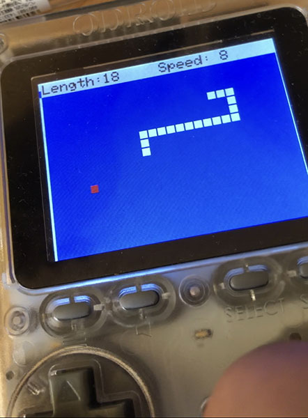

#SNAKE for Odroid-GO

This program is "SNAKE for Odroid-GO" that is modificatio of "SNAKE with M5STACK" by macsbug.

 

#### Speed setting:

	Change inisial speed: up/down cross key.

#### Control:
	Up/Down/Left/Right: cross key

#### START/RETRY
	A, B, Start or Select key 
	

#### Source code

- [SNAKE with M5STACK" by macsbug](https://macsbug.wordpress.com/2018/01/14/esp32-snake-with-m5stack/)
- ["esp32-snake" by HailTheBDFL](https://github.com/HailTheBDFL/esp32-snake)

#### Library
- [ESP32-Chimera-Core" library](https://github.com/tobozo/ESP32-Chimera-Core)

